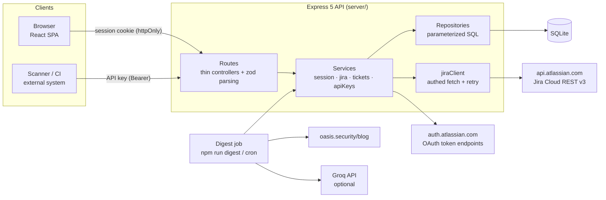
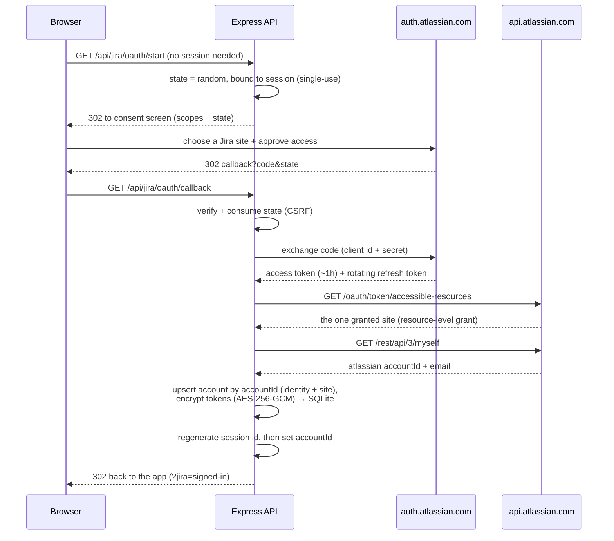
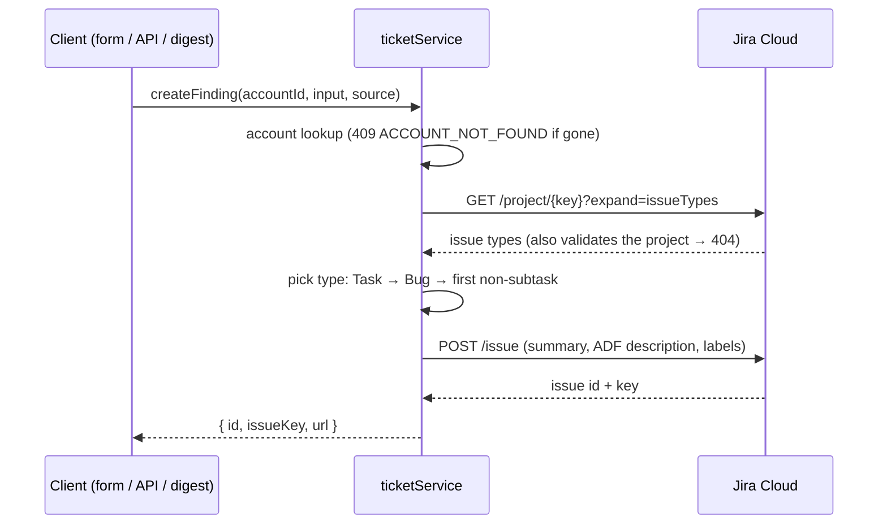
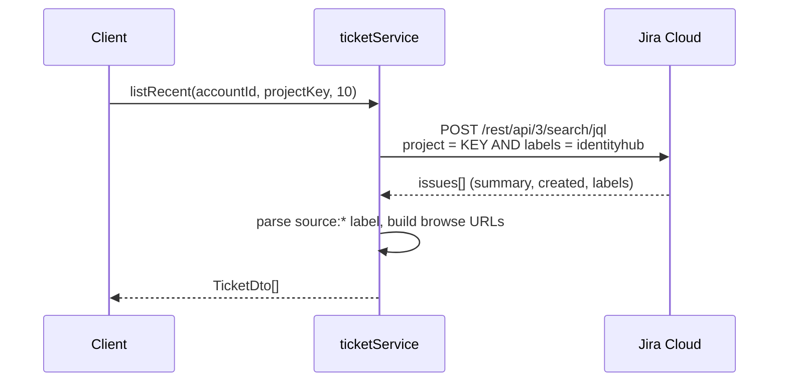

# Architecture

## System overview



Three entry points — browser session, API key, digest script — all converge on the **same service layer**. A ticket is created exactly one way (`ticketService.createFinding`), whatever its origin; only the authentication differs.

The digest is a standalone process, not a route: nothing in the API imports it ([DECISIONS #12](DECISIONS.md)).

## Layering rules

```
routes (HTTP: parse input with shared zod schemas, map to services, shape responses)
  └─ services (business logic, error mapping to AppError)
       ├─ repositories (hand-written parameterized SQL against SQLite)
       └─ jiraClient / atlassianOAuth (outbound HTTP to Atlassian)
```

- The web app never talks to Jira — only to our API. Jira credentials never reach the browser.
- Routes never touch the database directly; services never touch `req`/`res`.
- `shared/` holds the Zod schemas and DTO types used by server **and** web — validation logic exists once ([DECISIONS.md #13](DECISIONS.md)).
- Every non-2xx response uses one JSON envelope: `{ "error": { "code", "message", "details?" } }`.

## Sign in with Atlassian — one flow for auth *and* Jira access



Two things worth noting in that trace:

- **The site is chosen on Atlassian's screen, not ours.** The app uses resource-level grants, so the token is scoped to one site and `accessible-resources` returns only it. There is no in-app site picker, and switching sites means re-consenting ([DECISIONS #2c](DECISIONS.md)).
- **Identity comes from `/myself`, and the `accountId` it returns is global** — not site-specific — so it identifies the person no matter which Jira they authorized.

### Token lifecycle

Atlassian access tokens live ~1 hour; refresh tokens **rotate** — every refresh returns a new pair and kills the old refresh token. That shapes the design:

- **Proactive refresh** when a token is within 60s of expiry, plus a **retry-once on 401** for tokens revoked out-of-band.
- **Per-account lock** around refresh: concurrent requests serialize, so two requests can never both spend the same rotating refresh token (the loser would strand the connection). In-process only — a multi-instance deployment would move this to a shared lock ([DECISIONS.md #15](DECISIONS.md)).
- After a refresh inside the lock, siblings re-read the row and use the new token without refreshing again.
- `invalid_grant` (refresh token expired/revoked) → the API returns **409 `JIRA_RECONNECT_REQUIRED`** with "Your Jira authorization expired or was revoked. Please sign in again." The row is deliberately *not* deleted: the account row *is* the connection, so dropping it would also cascade away the user's API keys. Signing in again re-issues both tokens and updates the row in place. The UI surfaces the server's message — an inline alert in Recent Tickets, a toast on a failed create — rather than a dedicated reconnect screen.

## Creating a finding



**Jira is the only store for findings.** There is no local mirror: the `identityhub` and `source:*` labels written at create time are what let us recognise our own issues later, and the Recent Tickets view is a live JQL query against them. Nothing can drift out of sync because nothing is duplicated ([DECISIONS.md #9](DECISIONS.md) covers the trade-offs — editable labels, workspace-wide visibility, no audit record).



## Data model

| Table | Purpose | Notable columns |
|---|---|---|
| `accounts` | Atlassian identity **and** its Jira connection — the tenant | `atlassian_account_id` unique, `email`, `display_name`, `cloud_id`/`site_url`/`site_name` (all `NOT NULL` — the grant is site-scoped, so a signed-in account always has exactly one site, [#2c](DECISIONS.md)), `access_token_enc`, `refresh_token_enc` (AES-256-GCM), `access_token_expires_at` |
| `sessions` | Server-side session store | `sid`, JSON `data`, `expires_at` |
| `api_keys` | Public-API credentials | `key_hash` (SHA-256), `key_hint`, `revoked_at`, `last_used_at`, `name` (unique per account, `COLLATE NOCASE` — the name is all the user has to tell keys apart once the plaintext is gone) |

Note what is *absent*: no `tickets` table (findings live in Jira and nowhere else, #9) and no digest bookkeeping (the digest is a standalone script, #12).

Every user-owned table carries `account_id` (`api_keys` today, with `ON DELETE CASCADE` to `accounts`), and **every repository query filters on it** — that is the tenancy boundary (verified by tests). The one deliberate exception is the Recent Tickets view, which is scoped by Jira project rather than by account, because it reads from Jira.

## Security model

| Layer | Mechanism |
|---|---|
| Sign-in | Atlassian OAuth only — no password is stored, hashed, or transmitted, so the entire password attack surface is absent |
| Sessions | httpOnly + SameSite=Lax cookie, server-side SQLite store, rolling 8h expiry, revocable on logout. **Session id is regenerated at sign-in** — necessary because anonymous sessions exist to hold the OAuth `state`, so without it an attacker could plant a validly-signed id and inherit the session (fixation) |
| CSRF | SameSite=Lax baseline + Origin-check middleware on state-changing routes + single-use OAuth `state`; `/api/v1` exempt (no cookies — API-key auth) |
| Jira tokens | AES-256-GCM at rest (fresh IV per encryption, auth tag); never sent to the client; never logged. Tokens only ever live in the `accounts` row — the session holds nothing but `accountId` and the in-flight OAuth `state` |
| API keys | 256-bit random with `ihk_` prefix, stored SHA-256-hashed, shown once, revocable, last-used tracking |
| Public API | Strict shared-schema validation, stable error codes; auth runs before routing (no route enumeration) |
| Transport hardening | helmet headers, 100kb JSON body limit |
| Multi-tenancy | All queries scoped by `account_id`; client cache wiped on logout |

## Production evolution

This is a deliberate POC. The documented path to production — org-level tenancy, KMS-managed keys, distributed locks, migrations, TLS/secure cookies, observability — is in [DECISIONS.md](DECISIONS.md) (#15 and per-ADR notes).
