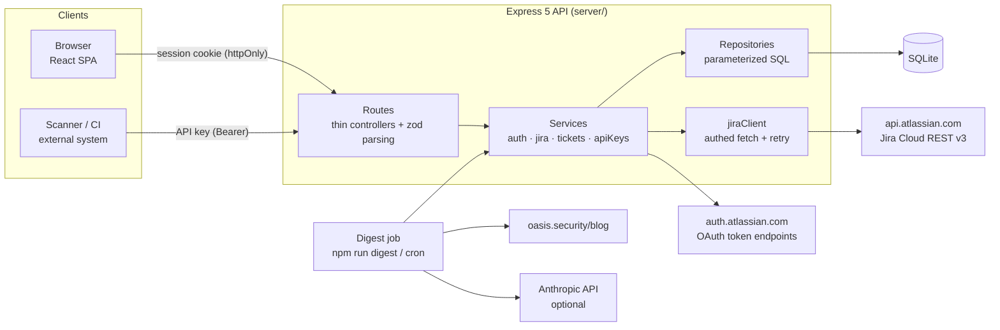
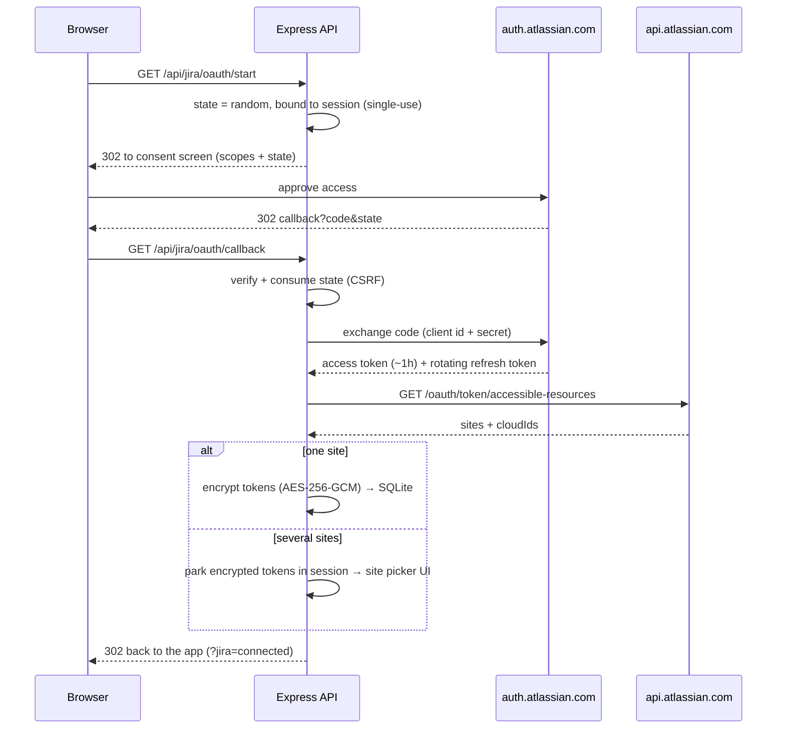
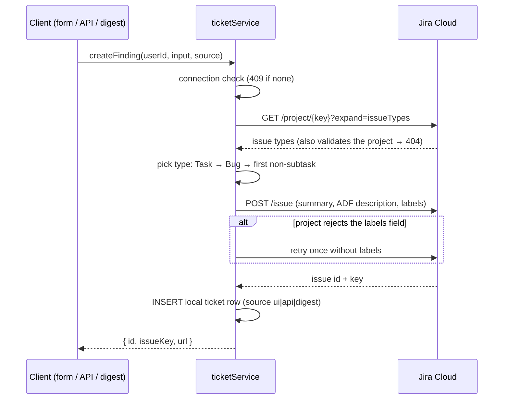

# Architecture

## System overview



Three entry points — browser session, API key, digest job — all converge on the **same service layer**. A ticket is created exactly one way (`ticketService.createFinding`), whatever its origin; only the authentication differs.

## Layering rules

```
routes (HTTP: parse input with shared zod schemas, map to services, shape responses)
  └─ services (business logic, error mapping to AppError)
       ├─ repositories (hand-written parameterized SQL against SQLite)
       └─ jiraClient / atlassianOAuth (outbound HTTP to Atlassian)
```

- The web app never talks to Jira — only to our API. Jira credentials never reach the browser.
- Routes never touch the database directly; services never touch `req`/`res`.
- `shared/` holds the Zod schemas and DTO types used by server **and** web — validation logic exists once ([DECISIONS.md #13](DECISIONS.md)).
- Every non-2xx response uses one JSON envelope: `{ "error": { "code", "message", "details?" } }`.

## Jira OAuth 2.0 (3LO) flow



### Token lifecycle

Atlassian access tokens live ~1 hour; refresh tokens **rotate** — every refresh returns a new pair and kills the old refresh token. That shapes the design:

- **Proactive refresh** when a token is within 60s of expiry, plus a **retry-once on 401** for tokens revoked out-of-band.
- **Per-user lock** around refresh: concurrent requests serialize, so two requests can never both spend the same rotating refresh token (the loser would strand the connection). In-process only — a multi-instance deployment would move this to a shared lock ([DECISIONS.md #15](DECISIONS.md)).
- After a refresh inside the lock, siblings re-read the row and use the new token without refreshing again.
- `invalid_grant` (refresh token expired/revoked) → the connection row is deleted and the API returns `JIRA_RECONNECT_REQUIRED`; the UI shows a clean reconnect card.

## Creating a finding



The **local `tickets` table is the source of truth** for "recent tickets created from this app" — Jira itself cannot answer that question. The `identityhub` label additionally marks our issues on the Jira side ([DECISIONS.md #9](DECISIONS.md)).

## Data model

| Table | Purpose | Notable columns |
|---|---|---|
| `users` | App accounts (tenants) | `email` unique, `password_hash` (scrypt) |
| `sessions` | Server-side session store | `sid`, JSON `data`, `expires_at` |
| `jira_connections` | One Jira link per user | `cloud_id`, `site_url`, `access_token_enc`, `refresh_token_enc` (AES-256-GCM), `access_token_expires_at` |
| `tickets` | Every ticket created via this app | `user_id`, `project_key`, `issue_key`, `jira_url`, `source ∈ ui/api/digest` |
| `api_keys` | Public-API credentials | `key_hash` (SHA-256), `key_hint`, `revoked_at`, `last_used_at` |
| `digest_state` | Digest idempotency ledger | `post_url` PK, `issue_key` |

Every user-owned table carries `user_id`, and **every repository query filters on it** — that is the tenancy boundary (verified by tests).

## Security model

| Layer | Mechanism |
|---|---|
| App auth | scrypt (Node crypto, OWASP params) + `timingSafeEqual`; identical error + comparable timing for unknown email vs wrong password |
| Sessions | httpOnly + SameSite=Lax cookie, server-side SQLite store, session regeneration on login (fixation), rolling 8h expiry |
| CSRF | SameSite=Lax baseline + Origin-check middleware on state-changing routes + single-use OAuth `state`; `/api/v1` exempt (no cookies — API-key auth) |
| Jira tokens | AES-256-GCM at rest (fresh IV per encryption, auth tag); never sent to the client; never logged; pending multi-site tokens encrypted even inside the session |
| API keys | 256-bit random with `ihk_` prefix, stored SHA-256-hashed, shown once, revocable, last-used tracking |
| Public API | Strict shared-schema validation, rate limiting, stable error codes; auth runs before routing (no route enumeration) |
| Transport hardening | helmet headers, 100kb JSON body limit, auth-endpoint rate limits |
| Multi-tenancy | All queries scoped by `user_id`; client cache wiped on logout |

## Production evolution

This is a deliberate POC. The documented path to production — org-level tenancy, KMS-managed keys, distributed locks, migrations, TLS/secure cookies, observability — is in [DECISIONS.md](DECISIONS.md) (#15 and per-ADR notes).
